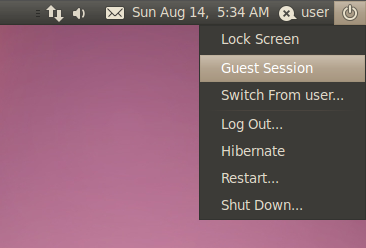

How to install P5Nitro - Linux
==============================

If you use your setup for work and feel more comfortable running things in a guest session, you can.

To do this in a guest login:

	

	wget -O - https://raw.github.com/davidedc/P5Nitro/master/ToolsAndSources/Installer/P5NitroInstallerLinux.sh | sh
	
